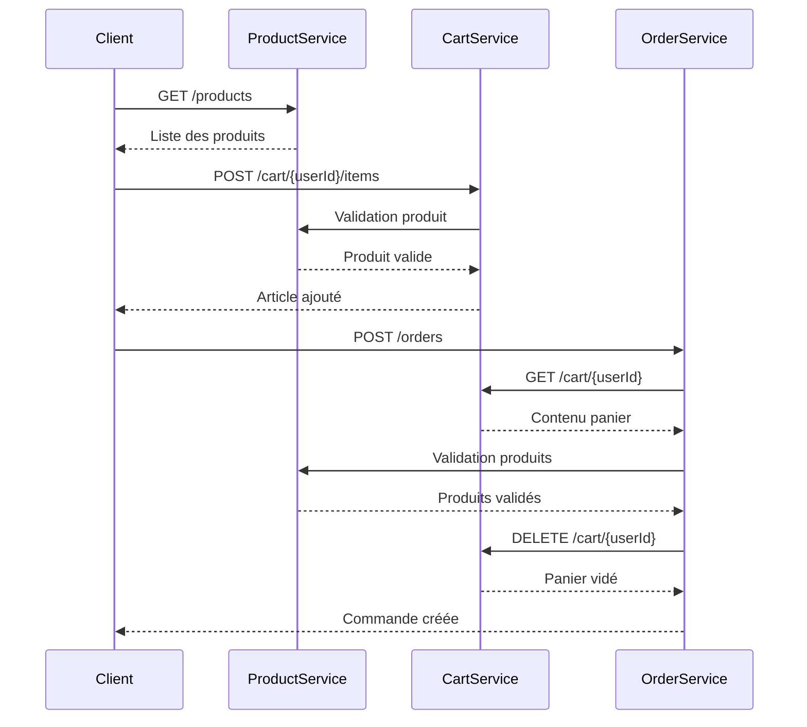

# 🛒 MiniShop - Architecture Microservices E-commerce


> **Projet académique** - Architecture microservices complète pour un système e-commerce développé dans le cadre d'un cours de développement cloud.

## 📋 Table des Matières

- [🎯 Aperçu du Projet](#-aperçu-du-projet)
- [🏗️ Architecture](#️-architecture)
- [🚀 Démarrage Rapide](#-démarrage-rapide)
- [📚 Services](#-services)
- [🛠️ Technologies](#️-technologies)
- [🧪 Tests](#-tests)
- [📖 Documentation API](#-documentation-api)
- [🐳 Déploiement](#-déploiement)
- [🤝 Contribution](#-contribution)

## 🎯 Aperçu du Projet

MiniShop est une implémentation complète d'une architecture microservices pour un système e-commerce. Le projet démontre les principes modernes du développement cloud avec une séparation claire des responsabilités entre services.

### ✨ Fonctionnalités Principales

- **Gestion des Produits** : Catalogue de produits avec stock
- **Panier d'Achat** : Ajout/suppression d'articles par utilisateur
- **Commandes** : Processus de commande complet avec validation
- **Communication Inter-Services** : API REST synchrone
- **Persistence** : Base de données PostgreSQL par service
- **Documentation** : APIs documentées avec Swagger/OpenAPI

### 🎬 Workflow E2E



## 🏗️ Architecture

```
┌─────────────────┐    ┌─────────────────┐    ┌─────────────────┐
│  Product Service│    │   Cart Service  │    │  Order Service  │
│                 │    │                 │    │                 │
│ Port: 3000      │    │ Port: 3002      │    │ Port: 3003      │
│ DB: 8764        │◄───┤ DB: 8765        │◄───┤ DB: 8766        │
│                 │    │                 │    │                 │
│ • Products      │    │ • CartItems     │    │ • Orders        │
│ • Stock         │    │ • User Carts    │    │ • OrderItems    │
└─────────────────┘    └─────────────────┘    └─────────────────┘
```

### 🔗 Communication Inter-Services

- **Product ← Cart** : Validation des produits lors de l'ajout au panier
- **Product ← Order** : Validation des produits lors de la création de commande
- **Cart ← Order** : Récupération et vidage du panier lors de la commande

## 🚀 Démarrage Rapide

### 📋 Prérequis

- **Node.js** 18+
- **npm** ou **yarn**
- **Docker** & **Docker Compose**
- **Git**

### ⚡ Installation

1. **Cloner le repository**
   ```bash
   git clone <repository-url>
   cd tp-ecommerce-main
   ```

2. **Installer les dépendances pour chaque service**
   ```bash
   cd product-service && npm install && cd ..
   cd cart-service && npm install && cd ..
   cd order-service && npm install && cd ..
   ```

3. **Démarrer les bases de données**
   ```bash
   chmod +x start-databases.sh
   ./start-databases.sh
   ```

4. **Exécuter les migrations**
   ```bash
   # Product Service
   cd product-service && npm run migration:run && cd ..
   
   # Cart Service
   cd cart-service && npm run migration:run && cd ..
   
   # Order Service
   cd order-service && npm run migration:run && cd ..
   ```

5. **Démarrer les services** (dans 3 terminaux séparés)
   ```bash
   # Terminal 1 - Product Service
   cd product-service && npm run start:dev
   
   # Terminal 2 - Cart Service  
   cd cart-service && npm run start:dev
   
   # Terminal 3 - Order Service
   cd order-service && npm run start:dev
   ```

### ✅ Vérification

Une fois tous les services démarrés, vous devriez voir :

- **Product Service** : http://localhost:3000
- **Cart Service** : http://localhost:3002  
- **Order Service** : http://localhost:3003

## 📚 Services

### 📦 Product Service

**Port**: 3000 | **Database**: PostgreSQL (8764)

Gère le catalogue de produits et les stocks.

**Endpoints principaux:**
- `GET /products` - Liste tous les produits
- `GET /products/:id` - Détails d'un produit
- `GET /products/:id/stock` - Stock d'un produit

**Entités:**
- `Product` : id, name, description, price, imageUrl, stock
- `Stock` : id, productId, quantity

### 🛒 Cart Service

**Port**: 3002 | **Database**: PostgreSQL (8765)

Gère les paniers des utilisateurs avec validation des produits.

**Endpoints principaux:**
- `POST /cart/:userId/items` - Ajouter un article
- `GET /cart/:userId` - Contenu du panier
- `DELETE /cart/:userId/items/:productId` - Supprimer un article
- `DELETE /cart/:userId` - Vider le panier

**Entités:**
- `CartItem` : id, userId, productId, quantity, createdAt, updatedAt

**Contraintes:**
- Unique(userId, productId) - Un produit par utilisateur

### 📋 Order Service

**Port**: 3003 | **Database**: PostgreSQL (8766)

Gère le processus de commande complet avec logique métier complexe.

**Endpoints principaux:**
- `POST /orders` - Créer une commande depuis le panier
- `GET /orders/:userId` - Commandes d'un utilisateur
- `GET /orders/order/:orderId` - Détails d'une commande

**Entités:**
- `Order` : id, userId, totalPrice, status, createdAt
- `OrderItem` : id, orderId, productId, quantity, price

**Logique métier:**
1. Récupération du panier utilisateur
2. Validation des produits
3. Calcul du prix total
4. Création de la commande (transaction)
5. Vidage du panier

## 🛠️ Technologies

### Backend
- **[NestJS](https://nestjs.com/)** - Framework Node.js progressif
- **[TypeScript](https://www.typescriptlang.org/)** - JavaScript typé
- **[TypeORM](https://typeorm.io/)** - ORM pour TypeScript/JavaScript
- **[PostgreSQL](https://www.postgresql.org/)** - Base de données relationnelle

### DevOps & Infrastructure
- **[Docker](https://www.docker.com/)** - Conteneurisation
- **[Docker Compose](https://docs.docker.com/compose/)** - Orchestration locale

### Documentation & Tests
- **[Swagger/OpenAPI](https://swagger.io/)** - Documentation API
- **[Insomnia](https://insomnia.rest/)** - Client REST pour tests
- **[Jest](https://jestjs.io/)** - Framework de tests

## 🧪 Tests

### Tests API avec Insomnia

1. **Importer la collection**
   ```bash
   # Ouvrir Insomnia et importer le fichier
   MiniShop-Insomnia-Collection.json
   ```

2. **Configuration des variables**
   - `base_url_product`: http://localhost:3000
   - `base_url_cart`: http://localhost:3002
   - `base_url_order`: http://localhost:3003
   - `user_id`: user-test-123

3. **Workflow E2E recommandé**
   - Récupérer les produits (`Get All Products`)
   - Ajouter des produits au panier (`E2E: Add iPhone to Cart`)
   - Vérifier le panier (`E2E: Check Cart Contents`)
   - Créer une commande (`E2E: Create Order`)
   - Vérifier la commande (`E2E: Check User Orders`)

### Tests Unitaires

```bash
# Exécuter les tests pour chaque service
cd product-service && npm test
cd cart-service && npm test  
cd order-service && npm test
```

## 📖 Documentation API

Chaque service expose sa documentation Swagger :

- **Product Service**: http://localhost:3000/api
- **Cart Service**: http://localhost:3002/api
- **Order Service**: http://localhost:3003/api

## 🐳 Déploiement

### Environnement Local avec Docker

Le script `start-databases.sh` configure automatiquement :

```bash
# Ports des bases de données
Product DB  : 8764
Cart DB     : 8765  
Order DB    : 8766

# Ports des services
Product Service : 3000
Cart Service    : 3002
Order Service   : 3003
```

### Kubernetes (Préparé)

Chaque service contient des manifests Kubernetes dans `deploy/local-k8s/` :

- `configmap.yaml` - Configuration
- `secret.yaml` - Secrets
- `deployment.yaml` - Déploiement
- `service.yaml` - Service
- `httproute.yaml` - Routage

## 📁 Structure du Projet

```
tp-ecommerce-main/
├── README.md                              # Documentation principale
├── start-databases.sh                     # Script de démarrage DB
├── MiniShop-Insomnia-Collection.json     # Tests API
├── README-Insomnia-Guide.md              # Guide tests
├── product-service/                      # Service produits
├── cart-service/                         # Service panier
└── order-service/                        # Service commandes
```

## 🤝 Contribution

Ce projet est développé dans un cadre académique. Pour contribuer :

1. Fork le projet
2. Créer une branche feature (`git checkout -b feature/amazing-feature`)
3. Commit les changements (`git commit -m 'Add amazing feature'`)
4. Push vers la branche (`git push origin feature/amazing-feature`)
5. Ouvrir une Pull Request

## 📝 Licence

Ce projet est développé à des fins éducatives dans le cadre d'un cours de développement cloud.

---

<div align="center">

**Développé avec ❤️ dans le cadre d'un cours de développement cloud**

[🔗 Documentation API](http://localhost:3000/api) • [🧪 Tests](./README-Insomnia-Guide.md) • [🐳 Docker](./start-databases.sh)

</div>
